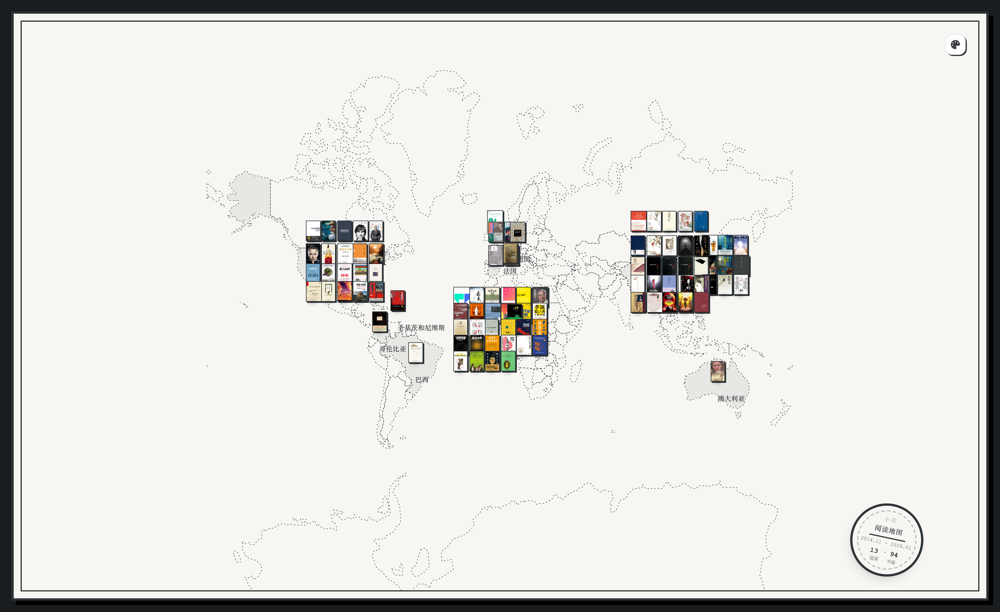
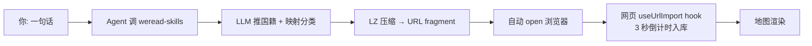

# 小径·书单地图 AI Skill

把你微信读书的书架,按**作者出生国**钉到一张世界地图上——你读过最远的地方,一眼可见。

整个流程交给 AI 完成:**Cursor / Claude Code 里说一句话**,10 秒后浏览器自动打开你的阅读地图。



> 上图是真实生成的一张地图:跨 13 国、94 本书,2014.11—2026.01 的阅读轨迹。

---

## 🚀 30 秒上手

### 第 1 步:让 AI 装好两个 skill

把下面这段话粘贴到 Cursor / Claude Code 对话框,AI 会自动装好(自动选合适的 skills 目录):

```
帮我装下面两个 skill:
1. https://weread.qq.com/r/weread-skills
2. https://github.com/Trentct/xiaojing-map
```

### 第 2 步:拿到你的微信读书 API Key

打开 [weread.qq.com/r/weread-skills](https://weread.qq.com/r/weread-skills) 按官方指引生成你的 `wrk-xxxx` Key,然后在终端:

```bash
export WEREAD_API_KEY=wrk-你的key
```

(建议写进 `~/.zshrc` / `~/.bashrc` 长期生效。)

### 第 3 步:对 AI 说一句话

```
用 xiaojing-map 生成我的书单地图
```

AI 会自动完成:

1. 拉你的微信读书书架(`/shelf/sync`)
2. 用 LLM 推断每位作者的国籍 + 映射分类
3. 把数据压缩成一个 URL fragment 链接
4. 自动打开浏览器 → 网页 3 秒倒计时 → 地图自动生成

**整个过程你只敲了 3 段文字,其中 1 段是 API Key。**

---

## 它做了什么

| 痛点 | 这个 skill 怎么解决 |
|------|---------------------|
| 手动整理书单太麻烦 | 一句话完成,AI 替你跑全套 |
| 国内访问 Wikidata 慢/超时 | LLM 在端侧直接推国籍,**完全跳过** Wikidata 查询 |
| 微信读书原始数据没分类映射 | skill 内置 14 类大类 + 子类细化规则,一并处理好 |
| 数据隐私顾虑 | 全程 local-first:数据走 URL fragment(浏览器内部,**永不上送服务器**) |

---

## 常见问题

**Q: 没装 `weread-skills` 行不行?**  
不行——本 skill 调微信读书 API 必须通过 `weread-skills` 转发。它是微信读书官方发布的依赖。

**Q: 我的书架很大(500+ 本),会不会爆?**  
正常 80 本左右压缩后 URL ~13KB。超过 ~500 本时 URL 可能超过 70KB,skill 会自动降级:把 JSON 写到 `~/Downloads/`,提示你拖入网页的"档案导入 → 微信读书 Agent"标签即可。

**Q: 某本书国籍识别错了怎么办?**  
打开网页 → 找到那本书 → 点编辑 → 改国家即可。改完会同步到本地 IndexedDB。

**Q: 不用 Cursor / Claude Code 能用吗?**  
本 skill 的设计依赖 Agent 自动执行。如果你想纯手动,可以:
1. 自己调微信读书 API 拿到书架 JSON
2. 按 [`schema.md`](./schema.md) 格式整理
3. 跑 `python3 scripts/make-url.py` 生成链接
但全程自动化的体验需要 Agent。

**Q: 私密书会被分享出去吗?**  
默认包含。如果不想让私密书出现在分享给朋友的链接里,可以让 AI 加 `--exclude-secret` 参数过滤(详见 [`schema.md`](./schema.md))。

---

## 工作原理



**关键设计**:

- **URL fragment 传数据**:`#weread=N4KAB...` 后面跟着 LZ-string 压缩的 JSON。fragment **不会**发送到服务器,纯浏览器内部处理。
- **`nationalityCode` 预解析**:Agent 端用 LLM 把作者→ISO 国家代码做好,网页端直接构造 `Author.birthCountry`,**完全跳过** Wikidata。
- **`uniqueKey` 去重**:同一本书重复导入自动跳过(`title::authorName` 唯一索引)。

---

## 仓库结构

| 文件 | 作用 |
|------|------|
| [`SKILL.md`](./SKILL.md) | Agent 入口手册,声明依赖检测 + 完整工作流 |
| [`schema.md`](./schema.md) | 与网页对接的 JSON 契约 |
| [`nationality-prompt.md`](./nationality-prompt.md) | 推作者国籍的 LLM prompt 模板 |
| [`category-mapping.md`](./category-mapping.md) | 微信读书分类 → 项目 BookCategory 映射规则 |
| [`scripts/make-url.py`](./scripts/make-url.py) | JSON → URL 编码脚本(含长度检查与自动降级) |

---

## 相关项目

- **书单地图网页**([Trentct/book-map-visualization](https://github.com/Trentct/book-map-visualization)) — 接收 skill 输出 + 渲染地图的网页端,部署在 [book-map-visualization.vercel.app](https://book-map-visualization.vercel.app)
- **weread-skills**(微信读书官方) — 微信读书 Agent skill,本项目的上游依赖

## License

MIT
