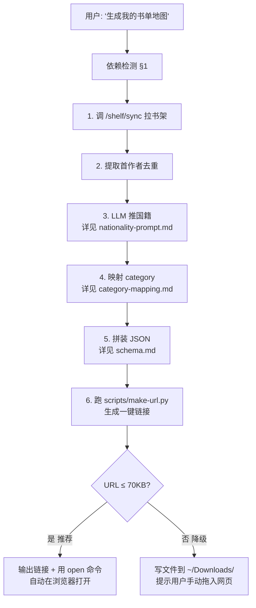

# 小径·书单地图 — 阅读足迹可视化 (Reading Map)

把你微信读书里读过的书,按**作者出生国**钉到世界地图上。
本 skill 负责调 weread-skills 拉书架 → LLM 解析国籍/分类 → 生成一键链接,
用户在浏览器打开链接即可看到自己的阅读版图。

项目主页:[https://www.pathiamap.com](https://www.pathiamap.com)
本 skill 仓库:[github.com/Trentct/xiaojing-map](https://github.com/Trentct/xiaojing-map)
配套网页仓库:[github.com/Trentct/book-map-visualization](https://github.com/Trentct/book-map-visualization)

---

## 1. 依赖检测(必读)

本 skill (`xiaojing-map`) **依赖** [weread-skills](https://weread.qq.com/r/weread-skills) (微信读书官方 skill)。
在执行任何命令前,先检测 `~/.claude/skills/weread-skills/SKILL.md` 是否存在:

- **不存在**:按官方推荐姿态自助安装——参照官方介绍页 `https://weread.qq.com/r/weread-skills`,
  通常一句话即可完成(下载并解压 `cdn.weread.qq.com/skills/weread-skills.zip` 到 `~/.claude/skills/`)。
  对应的 shell 命令是:
  ```bash
  curl -fL https://cdn.weread.qq.com/skills/weread-skills.zip -o /tmp/weread-skills.zip && \
    unzip -o /tmp/weread-skills.zip -d ~/.claude/skills/ && \
    rm /tmp/weread-skills.zip && \
    echo "✅ weread-skills 已安装"
  ```
- **存在**:直接进入工作流

另外检测 `WEREAD_API_KEY` 环境变量:
- 未设置 → 提示用户:`export WEREAD_API_KEY=<你的 wrk-xxxx>`(在官方介绍页 `https://weread.qq.com/r/weread-skills` 按指引生成),并停止
- 已设置 → 继续

---

## 2. 工作流(完整步骤)



### 2.1 详细步骤

**Step 1:拉书架**

```bash
curl -s -X POST "https://i.weread.qq.com/api/agent/gateway" \
  -H "Authorization: Bearer $WEREAD_API_KEY" \
  -H "Content-Type: application/json" \
  -d '{"api_name":"/shelf/sync","skill_version":"1.0.3"}' \
  > /tmp/weread_shelf.json
```

仅使用回包的 `books[]`(电子书)。`albums[]`(有声书)和 `mp`(文章收藏入口)本 skill v1 暂不处理。

**Step 2:提取首作者**

对每本书的 `author` 字段:

1. 剥离 `[美]` / `【德】` / `(英)` 等前缀(原文保留给输出 JSON 的 `author` 字段,但**用于推国籍时**用剥离后的部分)
2. 按分隔符切第一段:`/` `、` `,` `;` `；` `空格`(空格仅当两侧都是完整名字时算分隔符)
3. `·` 间隔号**不算**分隔符(如 `加西亚·马尔克斯` 是一个完整名字)

**Step 3:推国籍**

去重所有首作者,一次性按 `nationality-prompt.md` 的 prompt 调 LLM,得到 `{ 作者名: ISO国家代码 }` 映射。

**Step 4:映射 category**

按 `category-mapping.md` 的硬规则做映射;书没有 weread 分类时,在输出 JSON 里**省略** `category` 字段(让项目侧 `inferCategory(title)` 兜底)。

**Step 5:拼装 JSON**

格式见 `schema.md` §2。字段对应关系:

| weread `/shelf/sync` 字段 | JSON 字段 | 处理 |
|---------------------------|-----------|------|
| `bookId` | `weread_bookId` | 字符串化 |
| `title` | `title` | trim |
| `author` | `author` | **保留原文**(含 `[美]` 前缀,项目侧能识别) |
| (首作者推断) | `nationalityCode` | ISO 2-letter,UNKNOWN 表示无法判断 |
| `cover` | `cover` | URL 直存 |
| `category` | `weread_category` | 原始 `"大类-小类"` |
| (Step 4 映射) | `category` | 项目侧 BookCategory;未映射时省略 |
| `readUpdateTime` (秒) | `readDate` | ISO 8601(`new Date(ts * 1000).toISOString()`) |
| `finishReading === 1` | `finishReading` | boolean |
| `secret === 1` | `secret` | boolean |

**Step 6:生成一键链接**

```bash
python3 ~/.claude/skills/xiaojing-map/scripts/make-url.py \
  --input /tmp/weread-export.json \
  --output-url-file /tmp/xiaojing-map-url.txt
```

脚本会:
1. 计算 URL 长度
2. ≤ 70KB → 输出完整 URL,可选 `--open` 直接打开浏览器
3. > 70KB → 报错,提示降级到方案 B(把 JSON 写到 ~/Downloads/ 让用户手动拖入)

**Step 7:输出**

成功时给用户的格式建议:

```
✅ 已为你生成 65 本书的书单地图

📊 数据概览
- 总计: 65 本(电子书)
- 国籍已预解析: 57 / 65(8 本杂志/特殊条目标记为待补充)
- 涉及国家: 8 个(中国 28、美国 20、英国 2、德国 2、奥地利 2、波兰 2、法国 1、其他 8)

🗺️ 一键打开地图:
https://www.pathiamap.com/#weread=N4KAB...

(已自动在浏览器打开,3 秒后地图会自动生成)
```

---

## 3. 高频边界情况

| 情况 | 处理 |
|------|------|
| `book.category` 为 null 或空 | 输出 JSON 时省略 `category` 字段 |
| `book.author` 为空 | author 填 `"未知作者"`,nationalityCode 填 `UNKNOWN` |
| 多作者 (如 `尼克·梅塔 艾莉森·皮肯斯`) | author 保留原文,nationalityCode 只用**首作者**国籍 |
| 杂志类作者 (`财经` `公众号` `看世界` `雪球专刊`) | nationalityCode = `UNKNOWN` |
| 移民/跨国作家 | 按"主要国籍/出生国"判断;详见 nationality-prompt.md |
| `albums[]` (有声书) | v1 暂不处理 |
| `mp` (文章收藏入口) | v1 暂不处理 |
| URL > 70KB(超大书架) | 降级:写 JSON 到 `~/Downloads/weread-export-YYYY-MM-DD.json`,提示用户拖入网页"档案导入 → 微信读书 Agent"标签 |

---

## 4. 与项目的对接关系

```mermaid
flowchart LR
    Agent[本 skill<br/>xiaojing-map] -->|生成 URL| URL["#weread=<br/>LZ 压缩 JSON"]
    URL -->|用户点击| Web["书单地图网页<br/>(Vercel)"]
    Web -->|useUrlImport| Parser["werearchAgentParser"]
    Parser -->|ValidatedImportData[]| Service["batchImportService"]
    Service -->|带 nationalityCode<br/>跳过 Wikidata| Repo[bookRepository]
    Repo --> IDB[(IndexedDB)]
    IDB --> Map[渲染地图]
```

**关键**:`nationalityCode` 字段让项目网页**跳过国内不稳定的 Wikidata 查询**,这是本 skill 最大的价值所在。

---

## 5. 详细参考

- `schema.md` — 完整 JSON Schema 定义
- `nationality-prompt.md` — LLM 推国籍的 prompt 模板和示例
- `category-mapping.md` — weread 分类到项目 BookCategory 的映射表
- `scripts/make-url.py` — 链接生成脚本(含长度检查 + 降级逻辑)
